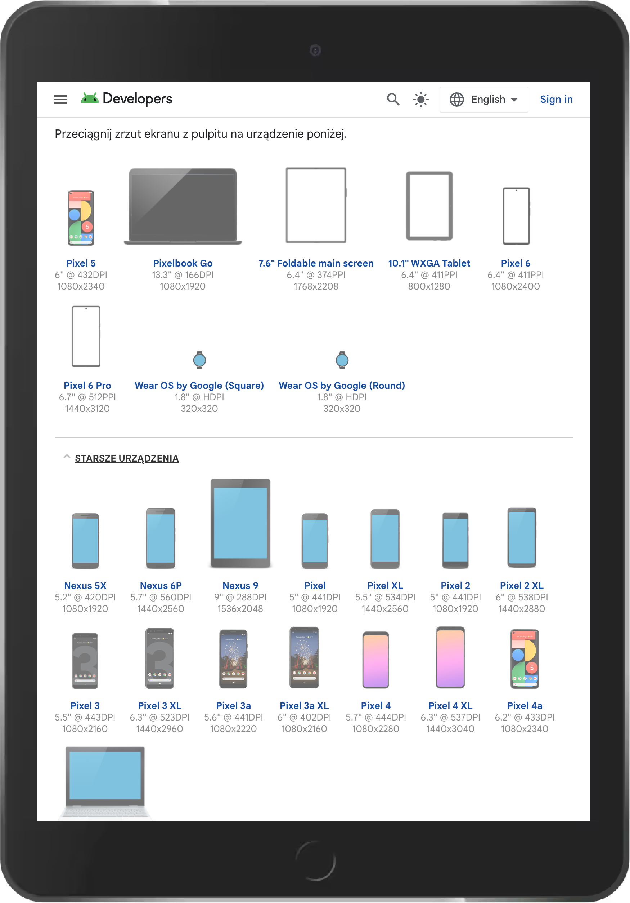
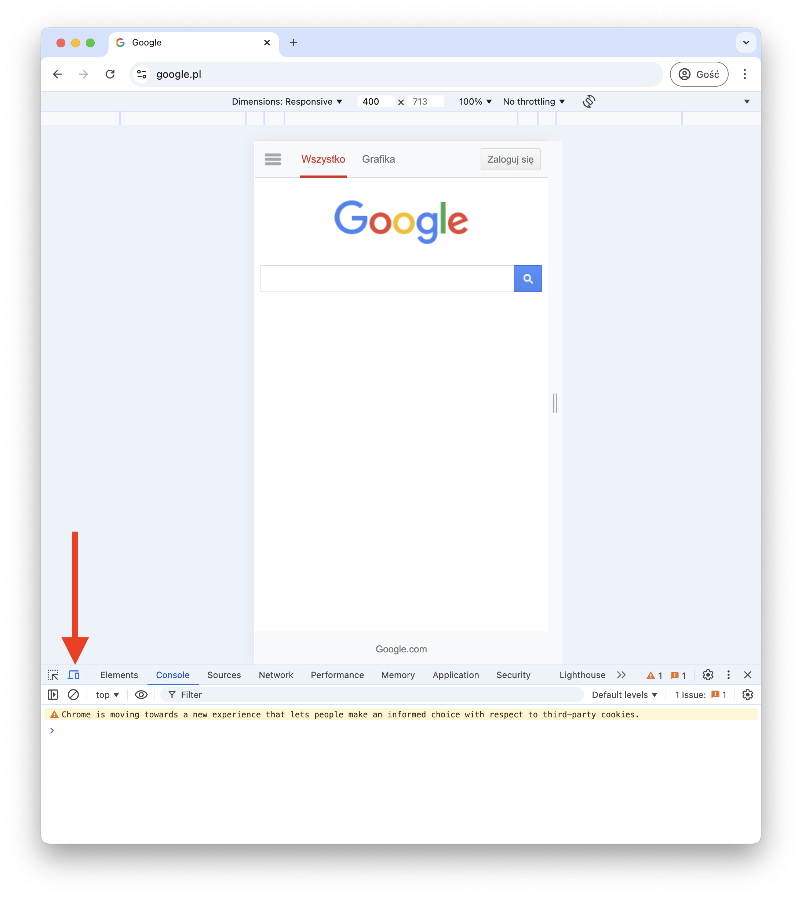
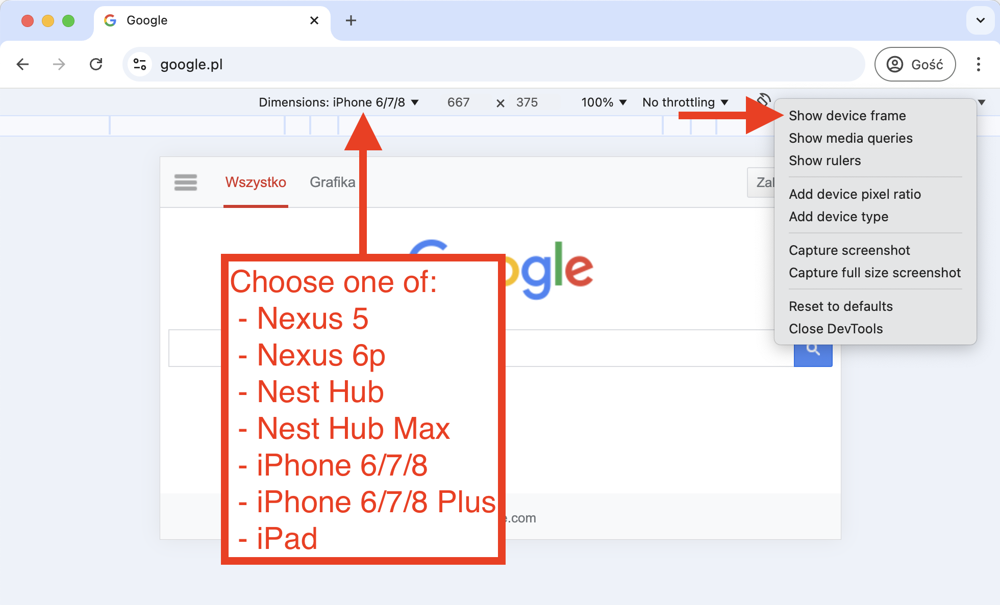
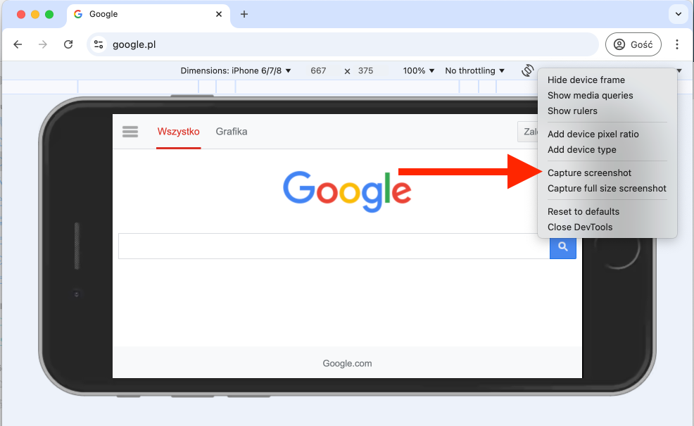

# Screenshots with device frames

How to make screenshots with device frames? How to make them look as if they were taken on a real device?

## Option 1: Device Art Generator from Google

Link: [https://developer.android.com/distribute/marketing-tools/device-art-generator](https://developer.android.com/distribute/marketing-tools/device-art-generator)

Create a standard screenshot and drag-and-drop on a device on the website.

Available devices:

- laptops (Pixelbook Go, Pixelbook)
- smartphones (Google Pixel in different versions)
- tablets (generic, Google Nexus)  
- smartwatches 

!!! note

    Note: the website does not crop the image, the screenshot should have the aspect ratio of the device.

## Option 2: Chrome Dev Tools

Open Google Chrome, open Dev Tools (F12), click "Toggle device toolbar" or Ctrl+Shift+M
to open the device toolbar.

Select one of the following devices from the list:

- Nexus 5x (smaprtphone)
- Nexus 6P (smaprtphone)
- Nest Hub (smart speaker with screen)
- Nest Hub Max (smart speaker with screen)
- iPhone 6/7/8 (smartphone)
- iPhone 6/7/8 Plus (smartphone)
- iPad (tablet)     

!!! warning "Select **exactly those devices**"

    Select **exactly those devices**.

    For example "iPad Pro" will not show the frame. It must be exactly "iPad".

    If the device is not on the list, click "Edit" and add it.

Click the little triangle in the top right corner to open the menu and select "Show device frame"

Click the little triangle again and select "Capture screenshot"

