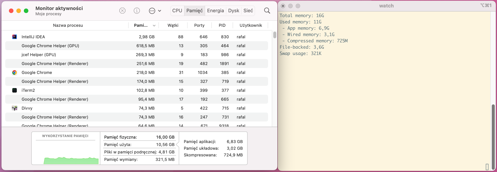

# Getting memory statistics from command line in MacOS

Getting memory statistics in MacOS from the command line is surprisingly difficult. Especially if you want to get the
same information as provided by Activity Monitor.

Below is the script which I made after digging through lots of online forums, examples, support threads etc.

!!! info "Compatibility"

    Manually tested on MacOS `Monterey` and MacOS `Ventura`

## Code
[⬇️ download](resources/macos-memory-statistics.sh)
```shell
--8<-- "resources/macos-memory-statistics.sh"
```

## Sample output:
```shell
Total memory: 32G
Used memory: 24G
 - App memory: 17G
 - Wired memory: 5.0G
 - Compressed memory: 2.1G
File-backed: 7.5G
Swap usage: 659K

```


## Correctness
**I do not guarantee the response is 100% correct!** 

On my machine running MacOS Monterey, during my manual tests, the data correctness is as follows:



| Gauge             | Correctness |
|-------------------|-------------|
| Total memory      | 100%        |
| Used memory       | 96%         |
 | App memory        | 99%         |
 | Wired memory      | 97%         |
 | Compressed memory | 100%        |
 | File-backed       | 66%         |
 | Swap usage        | 100%        |