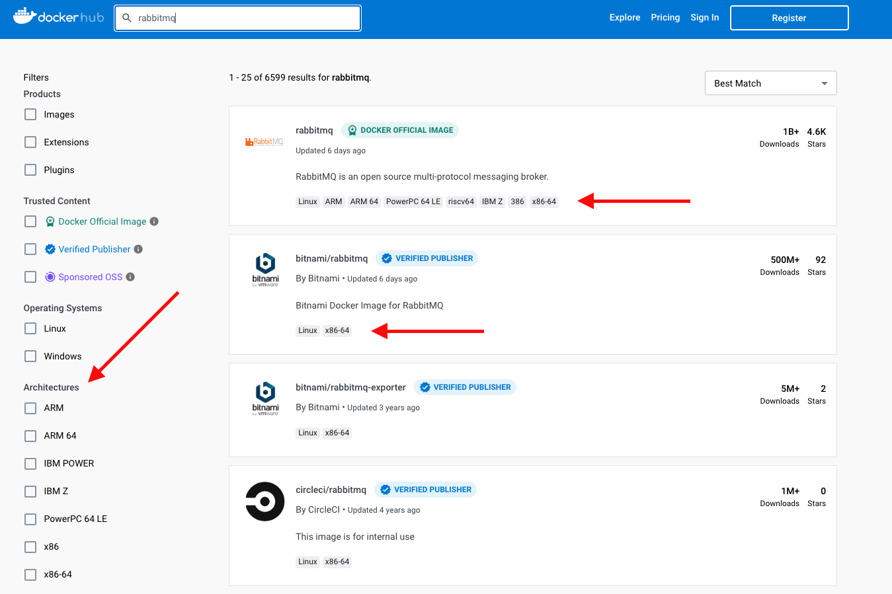

# Running docker `amd64` images on Apple Silicon M1/M2 chip

Apple Silicon M1/M2 chips use the `arm64` (a.k.a `aarch64`) architecture. This makes them different from the Intel
chips, which are
designed in `amd64` (a.k.a `x86_64`) architecture. Docker itself is a tool for virtualization, not emulation - it can
create abstraction
of the operating system, but cannot emulate different CPU.

Docker images can contain different binaries for different architectures - but the publisher must intentionally append
them to the image.
Sometimes they do it, sometimes they don't.



So now the question is: **how to run `amd64` image on Apple M1?**

## Best Option: use different image

This is really the easiest and best solution. Most of the well-known software comes in different images from different
publishers,
if you can't run one on them - just use others.

## Option 2: Experiment with colima platform emulation support

If you're using colima (see [MacOS: Docker without Docker Desktop](macos-docker-without-docker-desktop.md)) as Docker
runtime environment,
you can use a platform emulation support which is build-in colima.

Take a look:

```shell
# Starting non-emulated environment - aarch64
$ colima start
$ colima status
INFO[0000] colima is running using QEMU
INFO[0000] arch: aarch64
INFO[0000] runtime: docker
INFO[0000] mountType: 9p
INFO[0000] socket: unix:///Users/rafal.zarajczyk/.colima/default/docker.sock
$ docker run ubuntu:latest uname -a
Linux 6d3b17834140 5.15.82-0-virt #1-Alpine SMP Mon, 12 Dec 2022 09:15:17 +0000 aarch64 aarch64 aarch64 GNU/Linux
$ colima delete

# Starting x84_64 emulation using macOS Virtualization.Framework
$ colima start --vm-type vz --arch x86_64
$ colima status
INFO[0000] colima is running using macOS Virtualization.Framework
INFO[0000] arch: x86_64
INFO[0000] runtime: docker
INFO[0000] mountType: virtiofs
INFO[0000] socket: unix:///Users/rafal.zarajczyk/.colima/default/docker.sock
$ docker run ubuntu:latest uname -a
Linux 52575d133979 5.15.82-0-virt #1-Alpine SMP Mon, 12 Dec 2022 09:15:17 +0000 x86_64 x86_64 x86_64 GNU/Linux
$ colima delete

# Starting x84_64 emulation using QEMU
$ colima start --vm-type qemu --arch x86_64
$ colima status
INFO[0000] colima is running using QEMU
INFO[0000] arch: x86_64
INFO[0000] runtime: docker
INFO[0000] mountType: 9p
INFO[0000] socket: unix:///Users/rafal.zarajczyk/.colima/default/docker.sock
$ docker run ubuntu:latest uname -a
Linux da2ec14060a9 5.15.82-0-virt #1-Alpine SMP Mon, 12 Dec 2022 09:15:17 +0000 x86_64 x86_64 x86_64 GNU/Linux
```

To be honest I don't know the pros and cons of those two emulation ways. But this is definetelly something worth trying
if you have to run `amd64` images.

**Note:** colima allows also to specify other parameters - like the number of CPUs and available memory - so
you should be able to come up with the setup that fits your needs in the best way.

## (Not an) Option 3: wait till Rosetta support is there in Docker Desktop

Well this is not a real option, but there's an issue
[https://github.com/docker/roadmap/issues/384](https://github.com/docker/roadmap/issues/384) to add the Apple's
[Rosetta 2](https://en.wikipedia.org/wiki/Rosetta_(software)) emulator for Docker Desktop for Mac. But, as of October
2024, it's still an open issue.

BTW. You have to use the official Docker Desktop, which might be a licence problem if you're working in a large company
unwilling to pay for it.

## Option 4 (for desperate): install Docker on a virtual machine with CPU emulation

Use the [UTM](https://mac.getutm.app/) virtual machine manager for MacOS, create a virtual machine in **emulation**
mode,
install Ubuntu Server on it and run your image there. This works, but:

* the performance is bad. Like a really, really bad. 
* your software will run on a virtual machine, so you need to manually take care of port forwarding of all your required
  ports to your VM
  (not only typical docker port exposing, but also forwarding ports to the VM)
* sharing a folder with the VM using UTM requires installing additional tools in the guest system and a non-trivial
  setup
