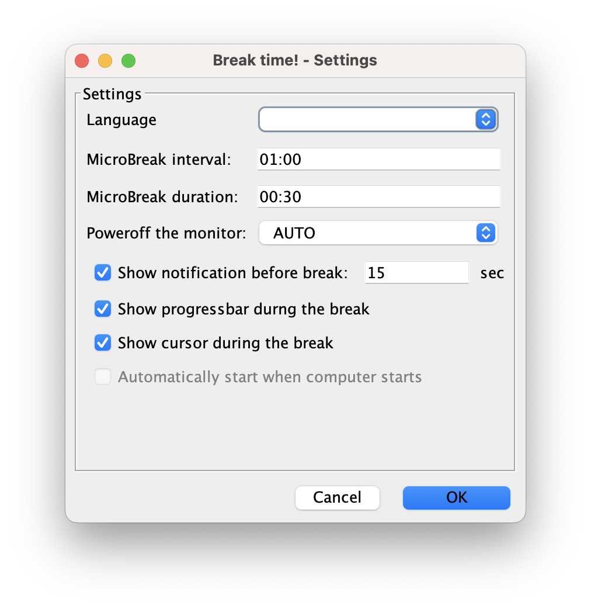

# Break time!

A small GUI software that enforces short micro-breaks at configurable intervals. It is designed for eye protection,
following ophthalmological guidelines. If you work with a computer for long periods, it's important to periodically look
at a distant spot to give your eyes practice in changing focus. This software will enforce you to do so.

Written in plain Java. The UI is created using Swing, with extensive help from the NetBeans UI Designer.

## History

This project was written more than 10 years ago in some old version of
Java by inexperienced version of me :-)

In 2024, it was resurrected by upgrading to Java 21, updating dependencies and fixing compatibility issues.
However, no source code was modified except for the necessary compatibility issues - it might feel like a time-travel
experience!

## Usage

Just run the JAR file. The software will sit in the system tray and enforce breaks at the configured intervals.

## Links

Source code: [https://github.com/rzarajczyk/break-time](https://github.com/rzarajczyk/break-time)

Download: [https://github.com/rzarajczyk/break-time/releases/latest](https://github.com/rzarajczyk/break-time/releases/latest)

## Compatibility

Tested on Windows 10 and macOS.

It will likely work on Linux as well (well it's Java), but I haven't checked it.

**Requires Java 21**