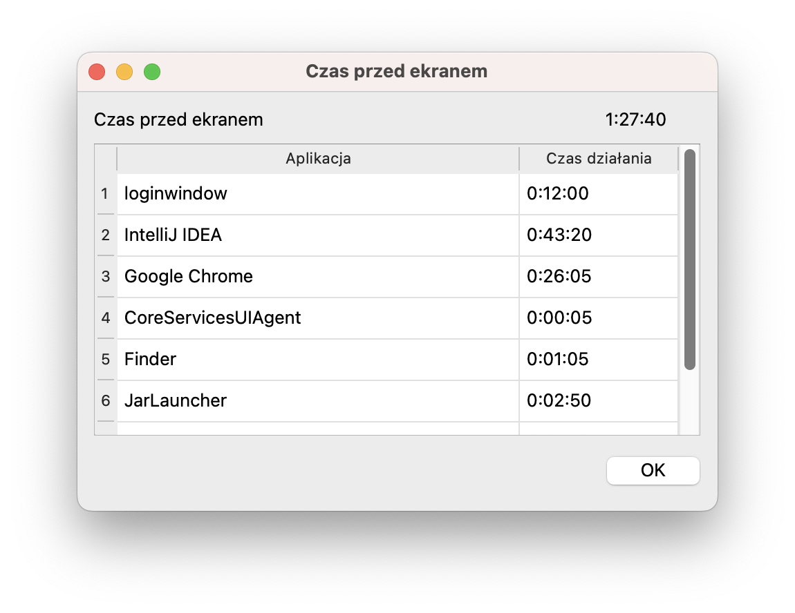

# Family Rules Client

!!! warning "This is an ongoing project. It has bugs!"

    It has still many bugs! I use it at home, but keep in mind that it's not a commercial product.

A client application that enforces the rules on the client's computer.
Written in Python (PySide6), distributed as a standalone application in a Windows and macOS version.

**The UI is in Polish only!**

What's interesting, to write this app I had to learn how to create a standalone application in Python.
I learned PySide6 and QtDesigner, how to package the app with PyInstaller, how to create installers for Windows and
macOS. Moreover, implementation of the "lock screen" required a bit of unusual code - it had to be a window, which
covers the whole screen, it had to be on top of all other windows, and the child should not be able to close it.

It was a great learning experience.

## Supported client states

- Active (default; usage is permitted)
- Locked (the lock screen is shown above all other windows, preventing the user from using the device)
- Locked with countdown (Locked, but before the lock screen is shown, a 60s countdown is displayed)
- Logged out (the user is forced to be logged out from the device)
- Logged out with countdown (Logged out, but before the lock screen is shown, a 60s countdown is displayed)
- App disabled (the app is completely disabled)

## Links

* [Source code](https://github.com/rzarajczyk/family-rules-client)
* [Downloads](https://github.com/rzarajczyk/family-rules-client/releases/latest)

## Usage

Download and install the software. The first time you run it, you will be asked for the server address, administrator
username and password and the device name.

After that, the app will start automatically with the system and enforce the rules.

However, there are some quirks/bugs you have to be aware of:

* :material-bug: the macOS installer window has invalid icon location. So you have to scroll the window horizontally do see the icon,
  which you have to drag to the Applications folder.
* :material-bug: the app is not signed, so you have to allow it in the system settings. On macOS, you have to allow it in the Security
  settings. On Windows, you have to allow it in the SmartScreen settings.
* :material-bug: if you're upgrading the app, first set the device stare to "App disabled" on the server, then upgrade the app, then
  set the device state back to "Active". Otherwise, the app will not work correctly.