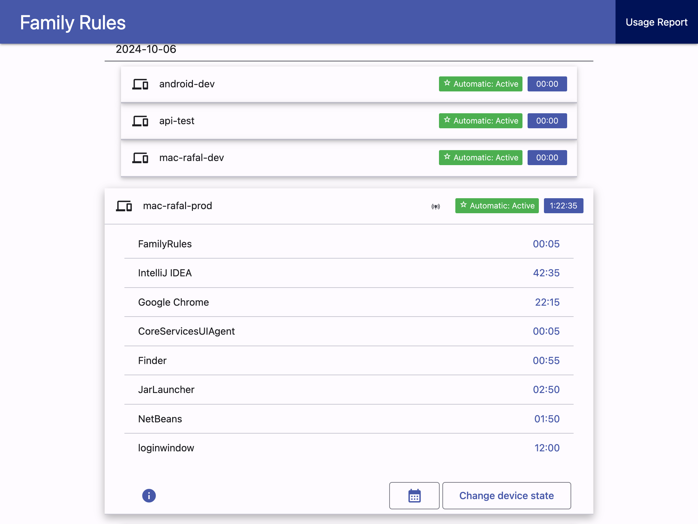
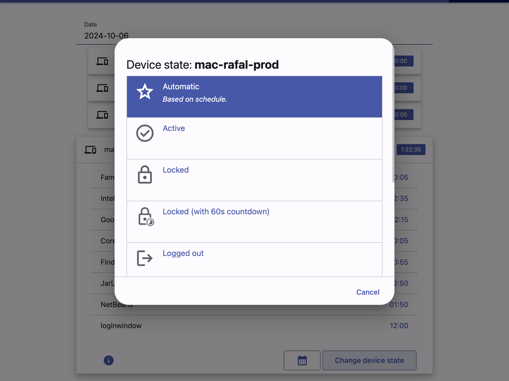
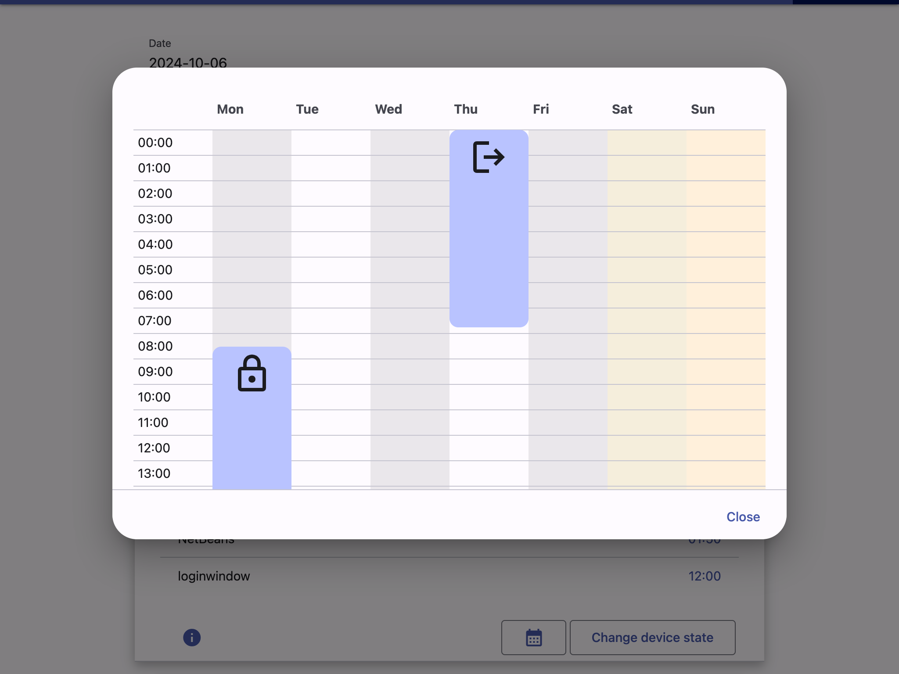

# Family Rules Server

!!! warning "This is an ongoing project. It has bugs!"

    It has still many bugs! I use it at home, but keep in mind that it's not a commercial product.


A backend server that manages the rules and provides an API for clients. It also
provides the web UI for administrator. Written in Kotlin, distributed as Docker image.

Requires PostgreSQL.





## Links

* [Source code](https://github.com/rzarajczyk/family-rules-server)
* [Docker hub](https://hub.docker.com/r/rzarajczyk/family-rules-server)

## Usage - docker compose

```yaml
services:
  postgres:
    container_name: postgres
    image: postgres:14-alpine
    restart: unless-stopped
    ports:
      - 5432:5432
    volumes:
      - ./data/postgres:/var/lib/postgresql/data
    environment:
      - POSTGRES_PASSWORD=<some password>
      - POSTGRES_USER=<some user>
      - POSTGRES_DB=<some name>

  family:
    container_name: family
    image: rzarajczyk/family-rules-server:latest
    restart: unless-stopped
    ports:
      - 8080:8080
    environment:
      - PG_HOSTNAME=postgres
      - PG_PORT=5432
      - PG_DBNAME=<some name>
      - PG_USER=<some user>
      - PG_PASS=<some password>
      - ADMIN_USER=<some admin user>        # default username
      - ADMIN_PASS=<some admin password>    # default password
      - SPRING_PROFILES_ACTIVE=prod
```

## Client API
See [Family Rules Server - Client API](projects-family-rules-api.md) for details.