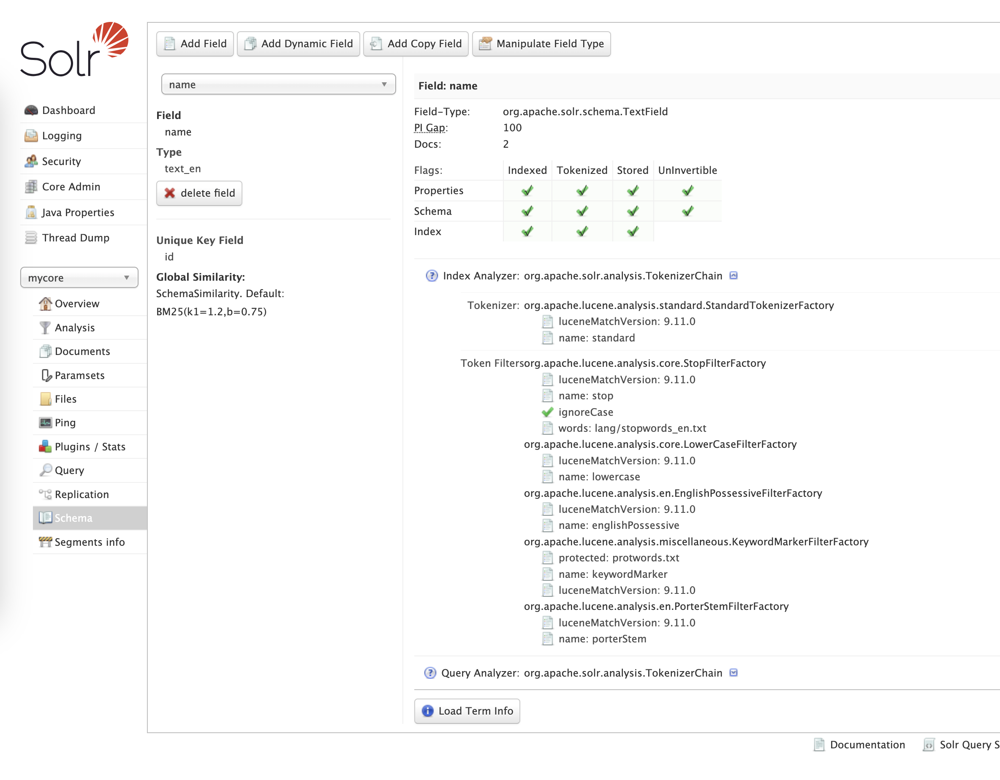

# Solr core configuration

## Docs and sources:

* [solrconfig.xml](https://solr.apache.org/guide/solr/latest/configuration-guide/configuring-solrconfig-xml.html)
* [managed-schema.xml](https://github.com/apache/solr/blob/main/solr/server/solr/configsets/_default/conf/managed-schema.xml)
* [Field Types Included with Solr](https://solr.apache.org/guide/solr/latest/indexing-guide/field-types-included-with-solr.html)
* [docValues](https://solr.apache.org/guide/solr/latest/indexing-guide/docvalues.html)
* [Understanding SOLR Field Properties: Indexed, Stored and docValues](https://medium.com/@komalrajput0801/understanding-solr-field-properties-indexed-stored-and-docvalues-deaf6c09f08f)
* [DocValues VS Stored Fields: Apache Solr Features and Performance SmackDown](https://sease.io/2020/03/docvalues-vs-stored-fields-apache-solr-features-and-performance-smackdown.html)
* [Document Analysis](https://solr.apache.org/guide/solr/latest/indexing-guide/document-analysis.html)
* [External files](https://solr.apache.org/guide/solr/latest/indexing-guide/external-files-processes.html)

## File structure of a `core/conf` directory

```shell
rafal@MacBook-Pro-Rafal solr-9.7.0 % ls -l server/solr/mycore/conf
total 108
drwxr-xr-x 41 rafal staff  1312 Sep  4 00:06 lang
-rw-r--r--  1 rafal staff 50695 Sep  4 00:06 managed-schema.xml
-rw-r--r--  1 rafal staff   873 Sep  4 00:06 protwords.txt
-rw-r--r--  1 rafal staff 44800 Sep  4 00:06 solrconfig.xml
-rw-r--r--  1 rafal staff   781 Sep  4 00:06 stopwords.txt
-rw-r--r--  1 rafal staff  1124 Sep  4 00:06 synonyms.txt
```

Most important files:

* `managed-schema.xml` - schema of the data. Previously known as `schema.xml`
* `solrconfig.xml` - configuration of the core, for example:
    * defining handlers (`/select` for searching, `/update` for indexing), query parsers, etc
    * adding plugins
    * merge policy
    * replication
    * see [docs](https://solr.apache.org/guide/solr/latest/configuration-guide/configuring-solrconfig-xml.html)

## `managed-schema.xml`

```xml
<?xml version="1.0" encoding="UTF-8" ?>
<schema name="default-config" version="1.7">
    <!-- field types -->
    <fieldType name="string" class="solr.StrField" docValues="true"/>

    <!-- fields -->
    <field name="id" type="string" indexed="true" stored="true" required="true" multiValued="false"/>
    <dynamicField name="*_s" type="string"/>

    <!-- unique key -->
    <uniqueKey>id</uniqueKey>

    <!-- copy fields -->
    <copyField source="sourceFieldName" dest="destinationFieldName"/>
</schema>
```

A good documentation is in the comments in the default `managed-schema.xml` file in the Solr
distribution: [managed-schema.xml](https://github.com/apache/solr/blob/main/solr/server/solr/configsets/_default/conf/managed-schema.xml)

### Noteworthy: field types

```xml

<fieldType
        name="id"
        class="solr.StrField"
        sortMissingLast="true"
        sortMissingFirst="false"
        multiValued="false"
        indexed="true"
        stored="true"
        docValues="true"
/>
```

All field
types: [Field Types Included with Solr](https://solr.apache.org/guide/solr/latest/indexing-guide/field-types-included-with-solr.html)

Some common types:

* `solr.StrField` - text saved "as is", not analyzed, not tokenized
* `solr.TextField` - text after tokenization and analysis
* `solr.BoolField`
* `solr.DoublePointField`
* `solr.IntPointField`
* `solr.DatePointField`
* `solr.ExternalFileField` - value of this field os stored in a separate file, mainly for function queries

### Three important data structures: indexed/stored/docValues

Let's say we have the following documents:

```xml

<add>
    <doc>
        <field name="id">Car 1</field>
        <field name="name">VW Golf hatchback</field>
        <field name="price">200</field>
    </doc>
    <doc>
        <field name="id">Car 2</field>
        <field name="name">Toyota Corolla hatchback</field>
        <field name="price">100</field>
    </doc>
    <doc>
        <field name="id">Car 3</field>
        <field name="name">Toyota Auris Touring</field>
      <field name="price">50</field>
    </doc>
</add>
```


#### Inverted index: `indexed="true"`

Per-field data structure, pointing from **tokens** (words) to **docIds**

```text
Index for field "name":
    "vw"        => Car 1
    "golf"      => Car 1
    "hatchback" => Car 1, Car 2
    "toyota"    => Car 2, Car 3
    "corolla"   => Car 2
    "auris"     => Car 3
    "touring"   => Car 3
    
Index for field "price":
    50          => Car 3
    100         => Car 2
    200         => Car 1 
```

Used for **quick searching for documents with given tokens**

???+ Example

    1. Query: "Toyota Hatchback"
    2. Index lookup:

    ```text
        "toyota"    => Car 2, Car 3
        "hatchback" => Car 1, Car 2
    ```

    3. Intersection of those sets: `{Car 2, Car 3} ∩ {Car 1, Car 2} = {Car 2}`
    4. Final result set: `{Car 2}`

**Use cases:** full-text search or filtering

---

#### Column-based token storage: `docValues="true"`

Per-field data structure, pointing from **docIds** to field **values**. See
[docValues docs](https://solr.apache.org/guide/solr/latest/indexing-guide/docvalues.html)

**Note:** docValues can be enabled only for some field typed. `TextField` is **not** among them.

```text
DocValues for field "name":
    <can't be created>
    
DocValues for field "price":
   Car 1 => 200
   Car 2 => 100
   Car 3 => 50
```

Used for retrieving valued during operations like sorting or faceting

**Use cases:**

- sorting
- faceting
- grouping
- function queries
- sometimes retrieving the values, but it's limited -
  see [docs](https://solr.apache.org/guide/solr/latest/indexing-guide/docvalues.html#retrieving-docvalues-during-search)

---

#### Row-based original values storage: `stored="true"`

Stored fields are used to store the original (not analysed) value per document:

```text
Stored values for Car 1:
    name: "VW Golf hatchback"
    price: 200
    
Stored values for Car 2:
    name: "Toyota Corolla hatchback"
    price: 100
    
Stored values for Car 3:
    name: "Toyota Auris Touring"
    price: 50
```

**Use cases**: when we want to get the values from the index

!!! Tip

    The common practice is NOT using search engine for retrieving values, due to performance reasons. Usually it's
    enough to return only docIds from the search engine, and use some external storage to hydrate the data.

---

### TextFields: analyzers and tokenizers

In case of `solr.TextField`, it's possible to define how the field is analyzed (modified) during indexing,
separately for the querying and indexing

```xml
<fieldType name="text_general" class="solr.TextField" positionIncrementGap="100" multiValued="true">
  <analyzer type="index">
    <tokenizer name="standard"/>
    <filter name="stop" ignoreCase="true" words="stopwords.txt" />
    <filter name="lowercase"/>
  </analyzer>
  <analyzer type="query">
    <tokenizer name="standard"/>
    <filter name="stop" ignoreCase="true" words="stopwords.txt" />
    <filter name="synonymGraph" synonyms="synonyms.txt" ignoreCase="true" expand="true"/>
    <filter name="lowercase"/>
  </analyzer>
</fieldType>
```

**tokenizer** - how to split text into tokens, some examples:

  * `standard` - splits by whitespace and punctuation
  * `whitespace` - splits by whitespace
  * `pattern`, `simplePattern` - splits by regexp
  * `keyword` - does not split, treat the whole string as a single token
  * `nGram` - splits into substrings of a specific length
  * `pathHierarchy` - used to tree-like paths (f.ex. directory structure)
  * and more...

**filter** - how to modify tokens, some examples:

  * `asciiFolding` - replaces national characters with latin equivalents (`ą` => `a`)
  * `englishMinimalStem` - changes plurals into singulars (English)
  * `lowercase` - lowercase
  * `stop` - filters our stopwords
  * `shingle` - creates groups of consecutive tokens
  * `synonymGraph` - allows to define synonyms
  * and much more...

See [Document Analysis](https://solr.apache.org/guide/solr/latest/indexing-guide/document-analysis.html)

## Support in the SolrUI
