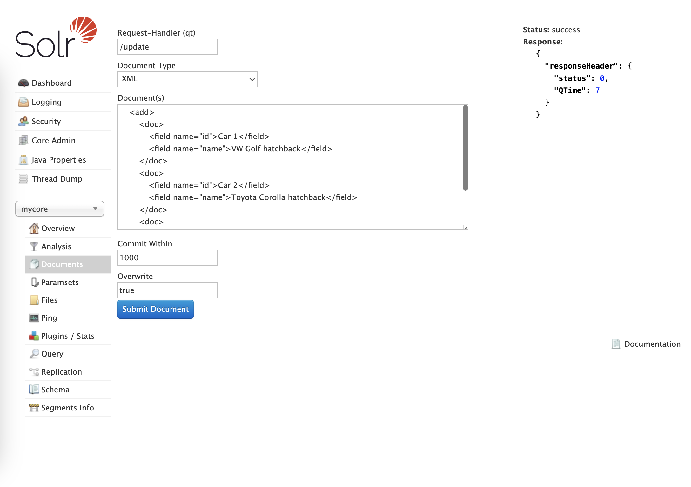
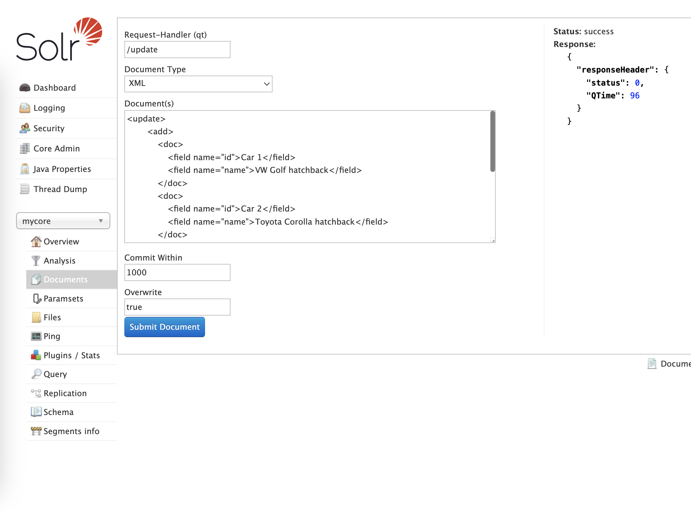

# Solr indexing

## Docs and sources:

* [Indexing with update handlers](https://solr.apache.org/guide/solr/latest/indexing-guide/indexing-with-update-handlers.html)
* [Client APIs](https://solr.apache.org/guide/solr/latest/deployment-guide/client-apis.html)
* [Partial Updates](https://solr.apache.org/guide/solr/latest/indexing-guide/partial-document-updates.html)
* [Commits and Transaction Logs](https://solr.apache.org/guide/solr/latest/configuration-guide/commits-transaction-logs.html)

## Basic syntax

=== "XML"

    ```xml
    <add>
        <doc>
            <field name="id">Car 1</field>
            <field name="name">VW Golf hatchback</field>
        </doc>
        <doc>
            <field name="id">Car 2</field>
            <field name="name">Toyota Corolla hatchback</field>
        </doc>
        <doc>
            <field name="id">Car 3</field>
            <field name="name">Toyota Auris Touring</field>
        </doc>
    </add>
    ```

=== "XML in SolrUI"

    

=== "XML + curl"

    ```shell
    printf '<add>
        <doc>
            <field name="id">Car 1</field>
            <field name="name">VW Golf hatchback</field>
        </doc>
        <doc>
            <field name="id">Car 2</field>
            <field name="name">Toyota Corolla hatchback</field>
        </doc>
        <doc>
            <field name="id">Car 3</field>
            <field name="name">Toyota Auris Touring</field>
        </doc>
    </add>' | curl -X POST -H "Content-Type: text/xml" --data-binary @- "http://localhost:8983/solr/mycore/update?commit=true"
    ```

## More complex example

=== "XML"

    ```xml
    <update>
        <add>
            <doc>
                <field name="id">Car 1</field>
                <field name="name">VW Golf hatchback</field>
            </doc>
            <doc>
                <field name="id">Car 2</field>
                <field name="name">Toyota Corolla hatchback</field>
            </doc>
            <doc>
                <field name="id">Car 3</field>
                <field name="name">Toyota Auris Touring</field>
            </doc>
        </add>
        <delete>
            <id>Car 1</id>
        </delete>
        <commit />
        <optimize />
    </update>
    ```
=== "XML in SolrUI"

    

=== "XML + curl"

    ```shell
    printf '<update>
        <add>
            <doc>
                <field name="id">Car 1</field>
                <field name="name">VW Golf hatchback</field>
            </doc>
            <doc>
                <field name="id">Car 2</field>
                <field name="name">Toyota Corolla hatchback</field>
            </doc>
            <doc>
                <field name="id">Car 3</field>
                <field name="name">Toyota Auris Touring</field>
            </doc>
        </add>
        <delete>
            <id>Car 1</id>
        </delete>
        <commit />
        <optimize />
    </update>' | curl -X POST -H "Content-Type: text/xml" --data-binary @- "http://localhost:8983/solr/mycore/update"
    ```

## Alternatives

There are also the [official clients](https://solr.apache.org/guide/solr/latest/deployment-guide/client-apis.html)
for Java, JavaScript, Python and Ruby

Solr also supports [other data formats (like JSON)](https://solr.apache.org/guide/solr/latest/indexing-guide/indexing-with-update-handlers.html), however XML seems to be the
most popular

There's also a special syntax for partial updates, where we want to update just
a few fields, while leaving others untouched: [Partial Updates](https://solr.apache.org/guide/solr/latest/indexing-guide/partial-document-updates.html)

## Why my changes are not visible? Commit changes

In order to make the data visible while searching, you have to **commit changes**.

**Soft commit** (for visibility, faster)

* makes the documents visible for searches

**Hard commit** (for durability, slower)

* ensures index files (segments) are fully written to the disk (fsync)
* closes transaction log and opens a new one

### How to commit data?

1. Manually: use the URL parameter `?commit=true` or `?softCommit=true` in update requests.
2. Manually: use command `<commit />` in update XML (hard commit)
3. Automatically: define `<autoCommit />` and/or `<autoSoftCommit />` in `solrconfig.xml`; you can set `maxDocs`, `maxTime`, `maxSize`

### Transaction Log (tlog)

Log of all updates since the last **hard commit**.
If Solr is not shutdown gracefully, it will replay updates from the tlog at startup.