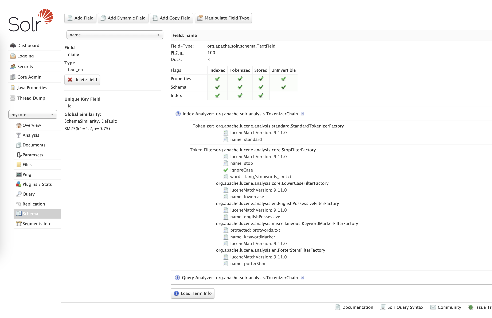
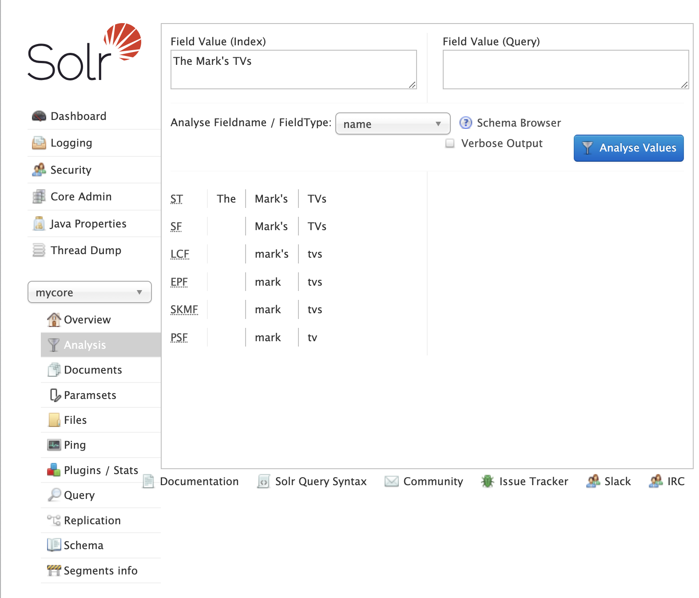
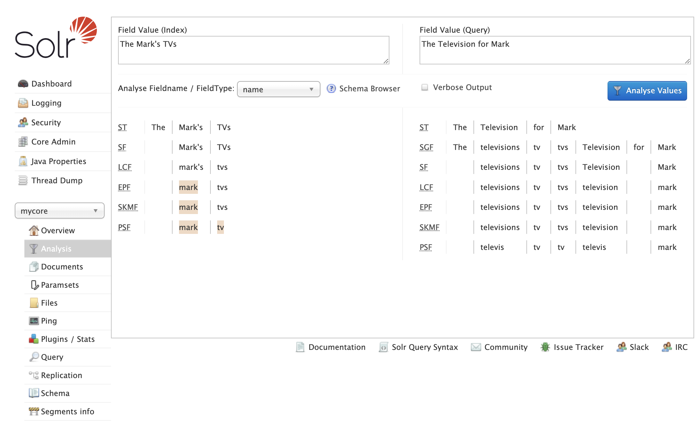
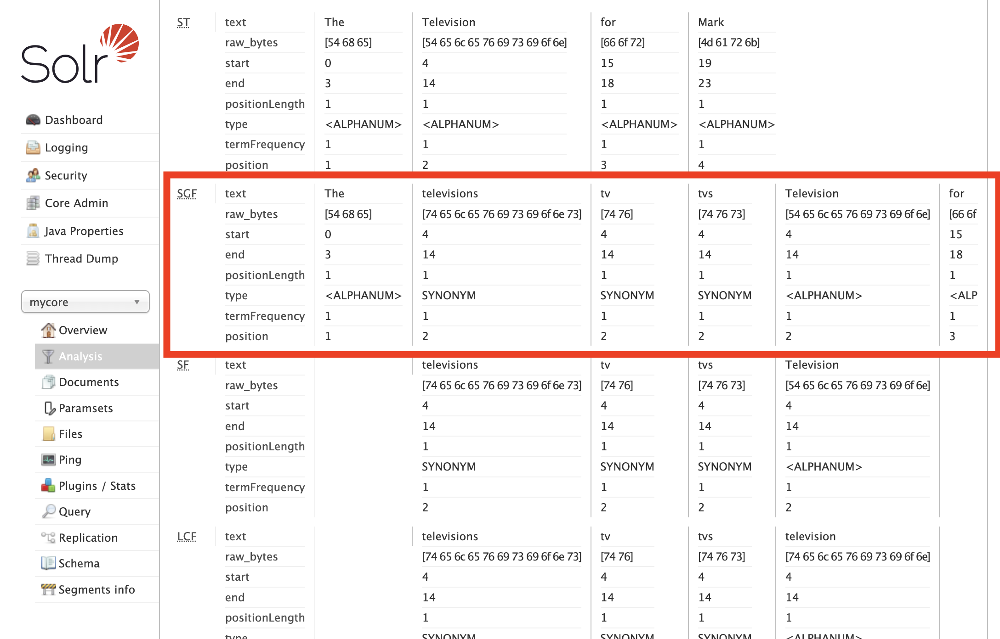

# Solr keyword matching

## Docs and sources:

* [Analysis Screen](https://solr.apache.org/guide/solr/latest/indexing-guide/analysis-screen.html)
* [Language Analysis](https://solr.apache.org/guide/solr/latest/indexing-guide/language-analysis.html)


## How do Solr performs keyword matching?

Let's assume we have defined the field `name` as type `text_en` from the default `managed-schema.xml` file in the Solr
distribution: [managed-schema.xml](https://github.com/apache/solr/blob/main/solr/server/solr/configsets/_default/conf/managed-schema.xml)

This fieldType is defined like this:

=== "managed-schema.xml"

    ```xml
        <fieldType name="text_en" class="solr.TextField" positionIncrementGap="100">
          <analyzer type="index">
            <tokenizer name="standard"/>
            <!-- in this example, we will only use synonyms at query time
            <filter name="synonymGraph" synonyms="index_synonyms.txt" ignoreCase="true" expand="false"/>
            <filter name="flattenGraph"/>
            -->
            <!-- Case insensitive stop word removal.
            -->
            <filter name="stop"
                    ignoreCase="true"
                    words="lang/stopwords_en.txt"
                />
            <filter name="lowercase"/>
            <filter name="englishPossessive"/>
            <filter name="keywordMarker" protected="protwords.txt"/>
            <!-- Optionally you may want to use this less aggressive stemmer instead of PorterStemFilterFactory:
            <filter name="englishMinimalStem"/>
            -->
            <filter name="porterStem"/>
          </analyzer>
          <analyzer type="query">
            <tokenizer name="standard"/>
            <filter name="synonymGraph" synonyms="synonyms.txt" ignoreCase="true" expand="true"/>
            <filter name="stop"
                    ignoreCase="true"
                    words="lang/stopwords_en.txt"
            />
            <filter name="lowercase"/>
            <filter name="englishPossessive"/>
            <filter name="keywordMarker" protected="protwords.txt"/>
            <!-- Optionally you may want to use this less aggressive stemmer instead of PorterStemFilterFactory:
            <filter name="englishMinimalStem"/>
            -->
            <filter name="porterStem"/>
          </analyzer>
        </fieldType>
    ```

=== "SolrUI"

    

### Indexing pipelines

So it has the following index-time analyzers:

1. tokenizer `standard` - splits the phrase into tokens by whitespace and punctuation 
2. filter `stop` - removes stopwords defined in `lang/stopwords_en.txt`
3. filter `lowercase` - makes all tokens lowercase
4. filter `englishPossessive` - removes `'s` from words
5. filter `keywordMarker` - protects words (defined in `protowords.txt`) from being modified by further stemmers
6. filter `porterStem` - stemmer, changes the word into it's basic form

On every document update, the field's value is passed by the indexing pipeline
to create tokens. We can simulate this process in the Solr's UI



This is rather self-explanatory.

1. Standard Tokenizes splits the phrase into tokens by whitespace and punctuation
2. Stopword filter removes the stopword `The`
3. Lowercase filter makes it all lowercase
4. English Possessive changes `mark's` into `mark`
5. Keyword Marker does nothing in this case (but we could use it to protect f.ex. "tvs" from further processing)
6. Stemmer changes words to its stems, here `tvs` into `tv`

### Query pipeline 

The query-time analyzers defined for this field are similar, except that
we have an additional filter: `synonymGraph` with synonyms defined in `synonyms.txt` file

Every search query is split into tokens by query-time analyzers. So let's check what will happen if we enter some query:



1. Tokenizer splits the query into tokens
2. Synonyms filter creates synonyms for `TV`
3. Lowercase filter makes it all lowercase
4. English Possessive checks for `'s` (there are no words like this in the query)
5. Keyword Marker does nothing in this case
6. Stemmer changes words to its stems, here `tvs` into `tv`, `television` into `televis`

#### We have a match
The UI shows also that tokens `mark` and `tv` are a match between query token and indexed token - matching tokens are highlighted.

#### Why do we have synonyms multiplied?
On a **non-verbose output** we can be surprised that we have four
synonyms instead of a single word. 

However, if we enable **verbose output** and scroll down, we can see more details:



We can see that all synonyms:

* have the same `start` and `end`
* has the same `position`
* are of type `SYNONYM`

This all means that Solr knows, that these are alternative tokens
placed in the same position.