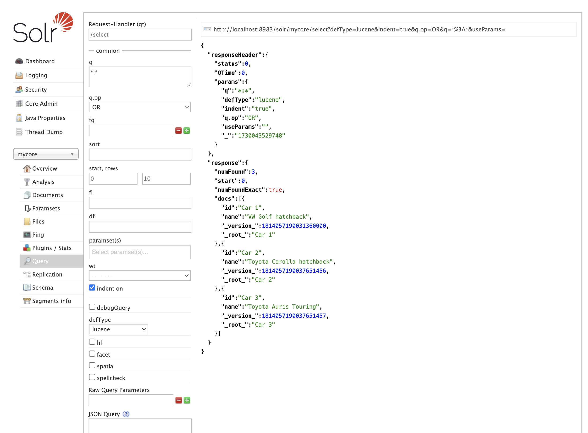

# Solr querying

## Docs and sources:

* [Query Syntax and Parsers](https://solr.apache.org/guide/solr/latest/query-guide/query-syntax-and-parsers.html)
* [Common Query Parameters](https://solr.apache.org/guide/solr/latest/query-guide/common-query-parameters.html)
* [Standard Query Parser](https://solr.apache.org/guide/solr/latest/query-guide/standard-query-parser.html)

## How do send queries to Solr?`

Basic example:

```shell
curl "http://localhost:8983/solr/mycore/select?q=*:*"
```

### About QueryParsers

The query syntax is strictly dependent on the QueryParser being used. Each parser has different syntax and capabilities.

### Common query parameters

Full list and
description: [Common Query Parameters](https://solr.apache.org/guide/solr/latest/query-guide/common-query-parameters.html)

Some examples:

| param         | description                                                           | examples                                                                                                     | defaultValue |
|---------------|-----------------------------------------------------------------------|--------------------------------------------------------------------------------------------------------------|--------------|
| `defType`     | which QueryParser should be used                                      | <ul><li>`dismax`</li><li>`edismax`</li><li>`lucene`</li></ul>                                                | `lucene`     |
| `q`           | main query                                                            | _depending on QueryParser_                                                                                   | _none_       | 
| `fq`          | filter query                                                          | `fq=popularity:[10 TO *]&fq=section:0`                                                                       | _none_       |
| `sort`        | result set sorting order                                              | <ul><li>`score desc`</li><li>`price asc, name desc`</li><li>`price asc, div(popularity,price) asc`</li></ul> | `score desc` |
| `start`       | for pagination: offset of page start                                  | `0`                                                                                                          | `0`          | 
| `rows`        | for pagination: number of documents                                   | `72`                                                                                                         | `10`         |
| `fl`          | fields to retrieve                                                    | <ul><li>`id,name,price`</li><li>`id na* price`</li><li>`*`</li><li>`div(popularity,price)`</li></ul>         | `*`          |
| `debug`       | return debug information                                              | <ul><li>`query`</li><li>`timing`</li><li>`results`</li><li>`all`</li></ul>                                   | _none_       |
| `timeAllowed` | the amount of time, in milliseconds, allowed for a search to complete | 2000                                                                                                         | _none_       |
| `wt`          | output format                                                         | <ul><li>`json`</li><li>`xml`</li><li>`csv`</li></ul>                                                         | `json`       |
| `echoParams`  | should the query parameters be included in the response               | <ul><li>`all`</li><li>`none`</li><li>`explicit`</li></ul>                                                    | `none`       |

Additionally, you can specify:

* [Faceting](https://solr.apache.org/guide/solr/latest/query-guide/faceting.html)
* [Highlighting](https://solr.apache.org/guide/solr/latest/query-guide/highlighting.html)

---

These parameters can be also set in the SolrUI



### Lucene Query Parser (Standard)

Docs: [Standard Query Parser](https://solr.apache.org/guide/solr/latest/query-guide/standard-query-parser.html)

| param  | description                            | defaultValue |
|--------|----------------------------------------|--------------|
| `q`    | main query (mandatory)                 | _none_       | 
| `q.op` | `AND` or `OR`, relation between tokens | `OR`         | 
| `df`   | which fields should be searched        | _none_       |


The main query syntax by example:

 * `vw golf` - searches for these words in fields defined in `df`, and joins them using `q.op`
 * `"vw golf"` - searches for phrase in fields defined in `df`. Tokens must be next to each other.
 * `gol?`, `gol*` - wildcards are supported
 * `golf~2` - fuzzy searching, finds similar words
 * `"vw golf"~3` - proximity search, tokens `vw` and `golf` must be within 3 words of each other
 * `name:vw` - searches for `vw` in field `name` 
 * `name:"vw golf"` - searches for phrase `"vw golf"` in field `name` 
 * `name:gol?`, `name:gol*`, `name:golf~2` - it's all supported
 * `name:*` - finds documents, which have some value in field `name` set
 * `price:[52 TO 1000]` - ranges for numeric fields (including those borders)
 * `price:{52 TO 1000}` - ranges for numeric fields (EXCLUDING those borders)
 * `price:{52 TO 1000]` - also possible
 * `price:[* TO 1000]` - also possible
 * `vw^4 golf` - token `vw` if boosted (more important) four times
 * `vw OR golf`, `vw AND golf`, `vw || golf`, `vw && golf` - explicitly specify operator between tokens
 * `"vw golf" OR toyota` - also possible
 * `(vw AND golf) OR toyota` - also possible
 * `vw NOT golf`, `vw ! golf` - also possible
 * `+vw -golf` - must include `vw`, cannot include `golf`
