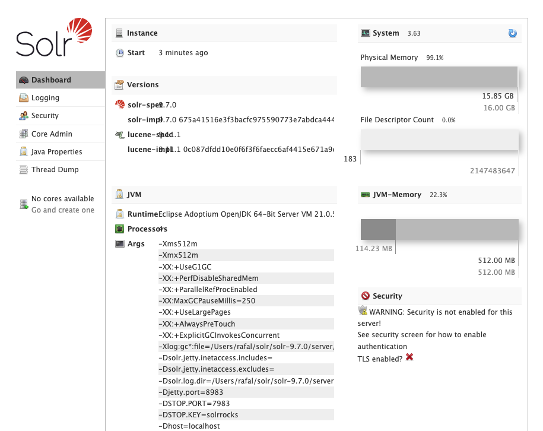
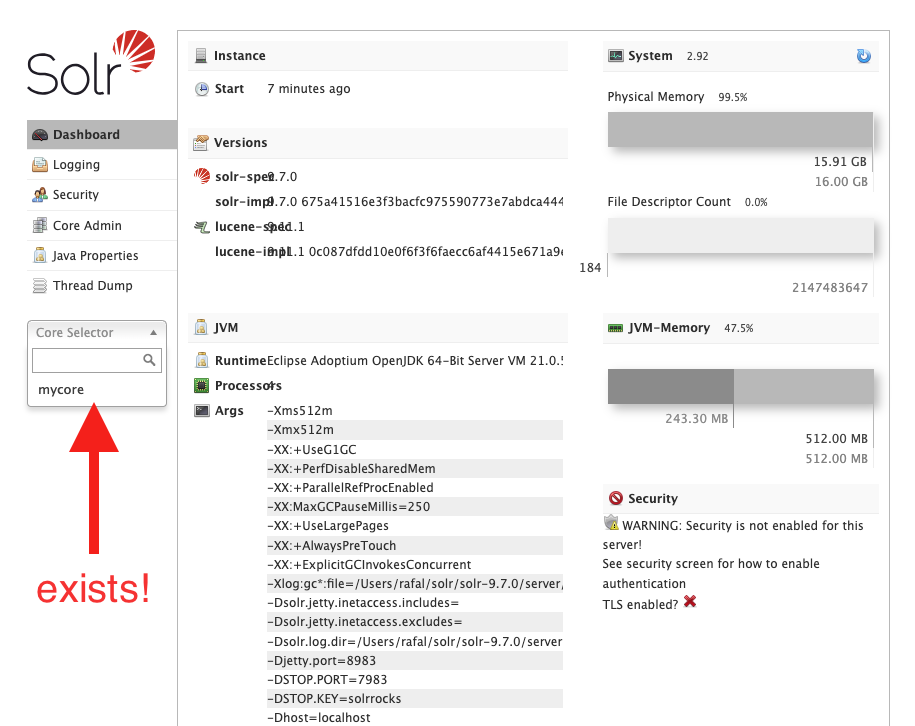

# Solr setup

## Sources:
This introduction is based on the official Solr documentation:

* [Installing Solr](https://solr.apache.org/guide/solr/latest/deployment-guide/installing-solr.html)
* [Downloads](https://solr.apache.org/downloads.html)
* [core.properties](https://solr.apache.org/guide/solr/latest/configuration-guide/core-discovery.html#the-core-properties-file)

## Download and run

```shell
wget "https://www.apache.org/dyn/closer.lua/solr/solr/9.7.0/solr-9.7.0.tgz?action=download" -O solr-9.7.0.tgz

tar -xvzf solr-9.7.0.tgz
cd solr-9.7.0.tgz

./bin/solr start

cat server/logs/solr.log

./bin/solr status
```

Open in the browser: [http://localhost:8983/](http://localhost:8983/)



## Create a core

!!! info "What is a core?"

    **Core** in Solr is equivalent of a **database** in PostgreSQL or MySQL or **index**
    in Elasticsearch. It is a logical collection of documents.

```shell
./bin/solr create -c mycore
```


## Directory structure of a core

```shell
rafal@MacBook-Pro-Rafal solr-9.7.0 % ls -l server/solr/mycore
total 4
drwxr-xr-x 8 rafal staff 256 Sep  4 00:06 conf
-rw-r--r-- 1 rafal staff  76 Oct 26 12:59 core.properties
drwxr-xr-x 5 rafal staff 160 Oct 26 12:59 data
```

* `core.properties` - this file tells Solr that this directory keeps a Solr core, see [core.properties](https://solr.apache.org/guide/solr/latest/configuration-guide/core-discovery.html#the-core-properties-file)
* `conf` - configuration
* `data` - data files. **It's safe to clear this directory to remove all data.**