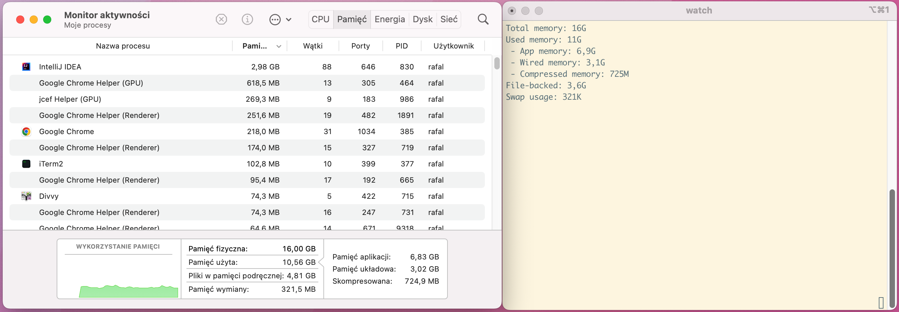

# Getting memory statistics from command line in MacOS

Getting memory statistics in MacOS from the command line is surprisingly difficult. Especially if you want to get the
same information as provided by Activity Monitor.

Below is the script which I made after digging through lots of online forums, examples, support threads etc.

## Code
<!--LISTING(resources/macos-memory-statistics.sh)-->
[⬇️ download](resources/macos-memory-statistics.sh)
```shell
#!/bin/zsh
#
# Note: this script requires coreutils
#
# > brew install coreutils
#

VM_STAT=$(vm_stat | grep --ignore-case "pages")
PAGE_SIZE_BYTES=$(vm_stat | head -n 1 | grep -oE "[0-9]+")

function pages_to_bytes() {
    echo "$(($1 * PAGE_SIZE_BYTES))"
}

function bytes_to_human_readable() {
    echo "$1" | numfmt --to iec
}

function get_vm_stat_value_bytes() {
    pages_to_bytes "$(echo "$VM_STAT" | grep "$1" | grep -oE "[0-9]+")"
}

TOTAL_BYTES=$(sysctl hw.memsize | grep -oE "[0-9]+")

SWAP_USAGE_MB=$(sysctl vm.swapusage | grep -oE "used = [0-9,.]+." | grep -oE "[0-9]+" | head -n 1)
SWAP_USAGE_BYTES="$((SWAP_USAGE_MB * 1024))"

PAGEABLE_PAGES=$(sysctl vm.page_pageable_internal_count | grep -oE "[0-9]+")
PAGEABLE_BYTES=$(pages_to_bytes "$PAGEABLE_PAGES")

PURGEABLE_BYTES=$(get_vm_stat_value_bytes "Pages purgeable")

APP_MEMORY_BYTES=$((PAGEABLE_BYTES - PURGEABLE_BYTES))

WIRED_BYTES=$(get_vm_stat_value_bytes "Pages wired")
COMPRESSED_BYTES=$(get_vm_stat_value_bytes "Pages occupied by compressor")

USED_BYTES=$((APP_MEMORY_BYTES + WIRED_BYTES + COMPRESSED_BYTES))

FILE_BYTES=$(get_vm_stat_value_bytes "File-backed pages")

echo "Total memory: $(bytes_to_human_readable "$TOTAL_BYTES")"
echo "Used memory: $(bytes_to_human_readable "$USED_BYTES")"
echo " - App memory: $(bytes_to_human_readable "$APP_MEMORY_BYTES")"
echo " - Wired memory: $(bytes_to_human_readable "$WIRED_BYTES")"
echo " - Compressed memory: $(bytes_to_human_readable "$COMPRESSED_BYTES")"
echo "File-backed: $(bytes_to_human_readable "$FILE_BYTES")"
echo "Swap usage: $(bytes_to_human_readable "$SWAP_USAGE_BYTES")"
```
<!--END LISTING-->

## Sample output:
```shell
Total memory: 32G
Used memory: 24G
 - App memory: 17G
 - Wired memory: 5.0G
 - Compressed memory: 2.1G
File-backed: 7.5G
Swap usage: 659K

```


## Correctness
**I do not guarantee the response is 100% correct!** 

On my machine running MacOS Monterey, during my manual tests, the data correctness is as follows:

[](resources/macos-memory-statistics-parity.png)

| Gauge             | Correctness |
|-------------------|-------------|
| Total memory      | 100%        |
| Used memory       | 96%         |
 | App memory        | 99%         |
 | Wired memory      | 97%         |
 | Compressed memory | 100%        |
 | File-backed       | 66%         |
 | Swap usage        | 100%        |

## Compatibility
Manually tested on:
 * MacOS `Monterey`
 * MacOS `Ventura`