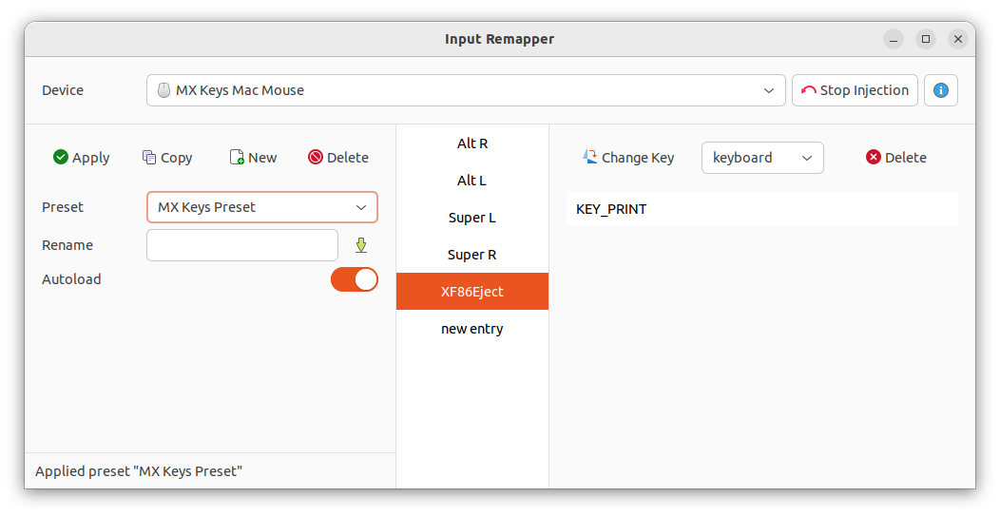

# Ubuntu initial setup

**Note:** Under construction!

## Logitech MX Keys Mac in Ubuntu 22.04

The **Logitech MX Keys Mac** keyboard workd generally fine in Ubuntu, however it has a bit different layout than the one Ubuntu expects.

Especially, two changes are required for smooth work:
 * switch Win and Alt keys
 * use Eject key as PrintScreen

### GUI tool for remapping the keyboard
```shell
sudo apt update && sudo apt install input-remapper
```


**Note on "Left Win" key**: Input Remapper is unable to capture "Left Win" key, as it starts Gonme's launcher screen.
To avoid that, install **Gnome Tweaks** from Ubuntu Software and temporarily change launcher screen keyboard shortcut.

### Function keys without `fn`

There's a `FnLock` button on the keyboard (usually it's written on the `Esc` key)

## Background effects in MS Teams Linux

For some reason the MS Teams desktop client in Linux doesn't support backgrouind effects. The same applies do web client in Firefox. But the web client in Chrome does support them! So **simply use Chrome for Teams!**

## OpenJDK 17 installation and command line tools
```shell
sudo apt update
sudo apt install -y openjdk-17-jdk
sudo apt install -y git

# Docker
curl -fsSL https://test.docker.com -o test-docker.sh
sudo sh test-docker.sh
sudo sh -eux <<EOF
# Install newuidmap & newgidmap binaries
apt-get install -y uidmap
EOF
dockerd-rootless-setuptool.sh install
echo 'echo "" >> ~/.bashrc' >> ~/.bashrc
echo 'export DOCKER_HOST=unix:///run/user/1000/docker.sock' >> ~/.bashrc
```

## GUI Tools
[Google Chrome](https://www.google.pl/chrome) - Google Chrome
[Slack](https://slack.com/downloads/linux) - Slack (note: use DEB version; do not use Snap version, it's buggy!)
```shell
snap install intellij-idea-ultimate --classic
```


## Gnome Extentions

[Dash-to-panel](https://extensions.gnome.org/extension/1160/dash-to-panel/) - makes Gnome look more like Windows (one horizontal bar at the bottom)

